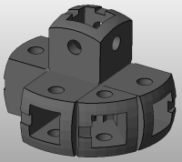
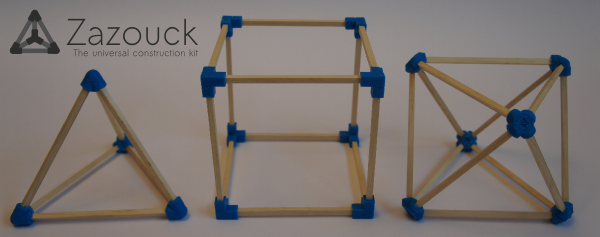

Zazoucko
=====

## Description
ZAZOUCK generatOr - Zazouck is an AmaZing Opensource Construction Kit

This program generates stl files to build a wonderful construction, from a 3D model. Here is an example of a generated part :



### How it works
The program works in 2 steps:
- First, it creates a table file (.csv) which containing the connectors parameters.
- Then, it creates stl files of the connectors, from the table.

### Differences between Zazouck and Zazoucko
On the picture herebelow, this is Zazouck, the construction kit : it's a customisable 3d printable part to connect wood, platic or metal rods together. Zazoucko is a program which generates Zazouck kits from a 3D model. You can use Zazouck without Zazoucko by using [the Openscad file](scad/corner.scad) or simply going on the  [Thingiverse page](http://www.thingiverse.com/thing:179597).



##Installation instuctions

### On Linux platforms
- Install dependencies

```shell
$ sudo apt-get install git openscad
```

- Get the sources

```shell
$ cd your_favorite_path
$ git clone https://github.com/roipoussiere/zazoucko.git
```

- Make it easy to use

```shell
$ cd zazoucko
$ chmod +xX *.py
$ echo export PATH=$PATH:your_favorite_path/zazoucko_python/ >> ~/.bashrc
```

### On Windows and MacOS platforms

Comming soon...

You can try to build from the sources, but it has never tested on these platforms yet.

##Usage
See [examples folder](examples/) to get 3D model examples

- To create a table describing each file, without generate them

```shell
$ zazoucko cube.stl -b ./table.csv # will create file 'table.csv'
$ zazoucko cube.stl -b # will create file 'cube.csv'
```

- To generate a directory containing all the .stl files

```shell
$ zazoucko cube.stl # from a 3D model
$ zazoucko cube.csv # from a table
```

- To generate a nice documentation:

```shell
$ zazoucko cube.stl -d
```
##Options
Use zazoucko -h to see all available options :

```
usage: zazoucko [-h] [-v] [-b [TABLE_PATH]] [-j NB_JOB_SLOTS] [-e EXPORT_DIR]
                [-p PARAMETER_PATH] [-l] [-S] [-s START_FROM] [-f FINISH_AT]
                [-d [DOC_DIR]] [-V [{0,1,2,3}]] [-D [DETAILS_PATH]]
                [-m [FULL_MODEL_PATH]]
                input_path

Zazoucko - The Open-source Universal Awesome Construction Kit.
This program allows you to build constructions, with generating files to print
from your model. It works in 2 times: first, it build a .csv table file (very
fast) describing the parts, then it compile this one into a lot of .stl files
(can be long).

positional arguments:
  input_path            3d model (.stl) or table (.csv) path of your model.
                        The program will automatically generates the .stl
                        files according to the file type.

optional arguments:
  -h, --help            show this help message and exit
  -v, --version         Show program version and exit.
  -b [TABLE_PATH], --build-only [TABLE_PATH]
                        Build only table (.csv) as TABLE_PATH (projet_name.csv
                        by default), without compile stl files.
  -j NB_JOB_SLOTS, --jobs NB_JOB_SLOTS
                        Compile NB_JOB_SLOTS parts simultaneously (usually,
                        set the same as the number of cores on your computer
                        is a good choice).
  -e EXPORT_DIR, --export-dir EXPORT_DIR
                        Directory where .stl files will be exported
                        (./projet_name/ by default)
  -p PARAMETER_PATH, --param-path PARAMETER_PATH
                        Parameters file path, containing parts parameters.
  -l, --low_qlt         The files are quickly compiled in low-quality. Usefull
                        for testing, not able to be print.
  -S, --sort            Doesn't shuffle the list of corners and polygons in
                        random order.
  -s START_FROM         Start compilation from line xx in the .csv file.
  -f FINISH_AT          Finish compilation at line xx in the .csv file.
  -d [DOC_DIR], --documentation [DOC_DIR]
                        Build a nice document in DOC_DIR (./doc by default),
                        to help you to build your construction easily.
  -V [{0,1,2,3}], --verbose-cmd [{0,1,2,3}]
                        Verbose level: 0 = nothing, 1 = OpenScad calls
                        (default), 2 = OpenScad warning messages, 3 = all
                        OpenScad messages.
  -D [DETAILS_PATH], --details [DETAILS_PATH]
                        Export details about the model (corners position,
                        polygons, corners_network, edges, etc.) in
                        DETAILS_PATH (./details.txt by default).
  -m [FULL_MODEL_PATH], --make_full_model [FULL_MODEL_PATH]
                        Create the 3d model of the construction in
                        FULL_MODEL_PATH (./full_model.stl by default).

Author: Nathanaël Jourdane - nathanael@jourdane.net
Zazoucko is licensed under GNU GPLv3: www.gnu.org/licenses/gpl-3.0.html
```

##Contact

nathanael[AT]jourdane[DOT]net

This project is licenced under GNU GPLv3 see COPYING.txt for details.
