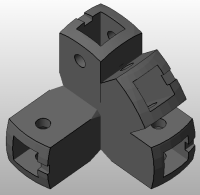

Zazoucko
=====

## Description
ZAZOUCK generatOr - Zazouck is an AmaZing Opensource Construction Kit

This program generates stl files to build a wonderful construction, from a 3D model. Here is an example of a generated part :



### How it works
The program works in 2 steps:
- First, it creates a table file wich containing parameters of the 3d model.
- Then, it creates the stl files of the connectors, from this table.

### Differences between Zazouck and Zazoucko
On the picture herebelow, this is Zazouck, the construction kit : it's a customisable 3d printable part to connect wood, platic or metal rods together. Zazoucko is a program which generates Zazouck kits from a 3D model. You can use Zazouck without Zazoucko by using [the Openscad file](scad/corner.scad) or simply going on the  [Thingiverse page](http://www.thingiverse.com/thing:179597).


##Installation instuctions

### On Linux platforms
- Install dependencies

```shell
$ sudo apt-get install git openscad
```

- Get the sources

```shell
$ cd your_favorite_path
$ git clone https://github.com/roipoussiere/zazoucko.git
```

- Make it easy to use

```shell
$ cd zazoucko
$ chmod +xX *.py
$ echo export PATH=$PATH:your_favorite_path/zazoucko_python/ >> ~/.bashrc
```

### On Windows and MacOS platforms

Comming soon...

You can try to build from the sources, but it's never tested on these platforms.

##Usage
-> see ./examples to get 3D model examples

- To create a table describing each file, without generate them

```shell
$ zazoucko cube.stl -b ./table.csv # will create file 'table.csv'
$ zazoucko cube.stl -b # will create file 'cube.csv'
```

- To generate a directory containing all the .stl files

```shell
$ zazoucko cube.stl # from a 3D model
$ zazoucko cube.csv # from a table
```

- To generate a nice documentation:

```shell
$ zazoucko cube.stl -d
```

Use zazoucko -h to see all available options.

##Contact

natha[AT]jourdane[DOT]net

This project is licenced under GNU GPLv3 see COPYING.txt for details.
